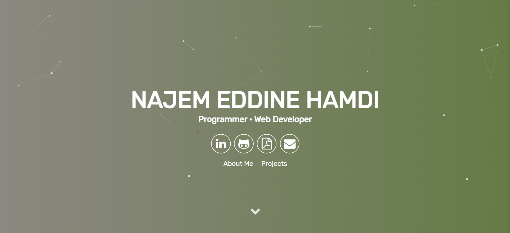

# <a href="https://najemeddinehamdi.github.io/najemeddine.github.io/" target="_blank">My Portfolio Website</a>

<!--  -->

[

 
This website serves as an online portfolio to showcase my web presence, résumé, story, & featured projects with a Particle.js aligned theme. It was generated using using Jekyll, Sass, and Gulp.js.

Please hit me up at hnajemeddine@gmail.com if you have any feedback or ideas for the website. Leave a :star: &nbsp;if you like it!
